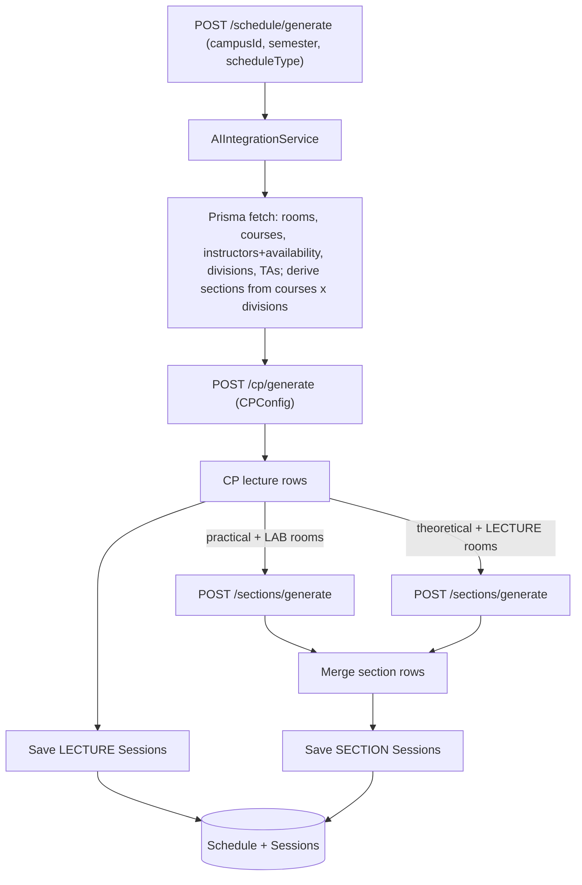

# AI Section Scheduling Integration

## Terminology mapping (AI <-> backend)

These names do NOT match 1:1 and must be mapped carefully:

- `doctors` (AI) === `Instructor` (backend) — the lecture professors who own/teach courses.
- `assistants` (AI) === `TA` (backend) — the people who run lab sections.
- In a generated section row, `Instructor_Name` is the course's **doctor** (backend `Instructor`), while `Assistant_Name` is the **TA** (backend `TA`). The section's assigned teacher (the `sections` input `Instructor_Name`/`Assistant`/`TA` column, matched via `sec_inst_col`) is a **TA**, not an Instructor.

## Context: what the AI needs vs. what the backend provides

The AI service in [AI/src](AI/src) is now a **CP-SAT** service (v2.0.0), not the GA service the backend still targets.

### Lecture endpoint (`POST /cp/generate`)

Input `data` = `rooms`, `courses`, `doctors`, `divisions` (field names unchanged); `config` = `CPConfig` (`time_limit_seconds`, `max_days_per_year`, `relax_if_infeasible`).

- Backend gaps in [ai-integration.service.js](BACKEND/src/services/ai-integration.service.js):
  - Calls stale `POST /schedule/generate` with GA config (`population_size`, `generations`, ...). The route no longer exists → 404.
  - `transformInstructorToAI` reads `instructor.day/startTime/endTime`, which no longer exist on `Instructor`. In [schema.prisma](BACKEND/prisma/schema.prisma) availability lives on `InstructorAvailability` (`day`, `startTime`, `endTime`, `status`). `fetchInstructors` does not `include: { availability }`, so every instructor collapses to one `Sunday 09:00-17:00` row.
- Already resolved (no longer blockers): `Department.code` and `Course.year` exist; AI time format `"2:00 PM"` is handled by `parseTime`.

### Section endpoint (`POST /sections/generate`)

Input `data` (see `SectionDataInput` in [models.py](AI/src/models.py)): `cp_schedule`, `rooms` (needs `Room` + `Type`), `sections`, `assistants`, `divisions`, `courses`, `doctors`. The scheduler [section_scheduler.py](AI/src/section_scheduler.py) assigns each section to a free Lab slot/assistant.

- `sections` rows: `Course_Name`, `Division`, `Section`, `Instructor_Name`, `Num_ID`, `Major` (all optional; matched flexibly via `find_column`).
- `assistants` rows: `Assistant_Name`, `Assistant_ID`.
- Backend gaps:
  - No `fetchAssistants` (TAs exist as `TA` model: `name`, `departmentId`, `userId?`).
  - No section payload builder, no `/sections/generate` call, no section save.
  - `scheduleType` ('lectures'|'sections'|'all') is validated in [schedule.validator.js](BACKEND/src/validators/schedule.validator.js) and passed by the controller, but the service signature ignores it.

### Decided source of sections

Sections are GENERATED, not pre-existing. The `Session(type=SECTION)` rows are the OUTPUT/sink, not the input.

- BOTH course types have sections: `PRACTICAL`-course sections belong in `LAB` rooms, `THEORETICAL`-course sections belong in `LECTURE_HALL` rooms.
- The `sections` input array is **derived on the fly** from courses joined with their student groups (divisions, matched by `departmentId` + `year`), with each group **split into multiple sections by room capacity** (`ceil(studentCount / sectionSize)`). No SECTION sessions need to exist beforehand.
- The AI picks rooms purely from the `rooms` list it is given (prefers any room typed "lab", else falls back to all supplied rooms) — there is no per-course room logic. So we make **two `/sections/generate` calls** and merge:
  - Practical courses + only `LAB` rooms (`sectionSize` = min LAB capacity).
  - Theoretical courses + only `LECTURE_HALL` rooms (`sectionSize` = min lecture capacity); the AI's "no lab -> all rooms" fallback then uses the lecture rooms.
- `assistants` = TAs for the campus; the AI auto-assigns them to sections (`Instructor_Name` left empty in the input).
- After both calls, the merged section rows are saved as new `Session(type=SECTION)` records linked to the new `Schedule`. No AI code changes are required.

## Data flow

## Implementation

### 1. Fix lecture (CP) call — [ai-integration.service.js](BACKEND/src/services/ai-integration.service.js)

- POST to `${AI_API_URL}/cp/generate` (not `/schedule/generate`).
- Replace GA `config` with `CPConfig`, e.g. `{ time_limit_seconds: 300, max_days_per_year: 3, relax_if_infeasible: true }`.
- Health check (`/health`) and response handling stay; `aiResult.schedule` / `total_assignments` remain compatible.

### 2. Fix instructor availability

- `fetchInstructors`: add `include: { department: true, availability: true }` (optionally only `status: 'APPROVED'`).
- Replace `transformInstructorToAI` with a builder that emits **one doctor row per availability entry**: `{ Instructor_ID, Instructor_Name, Department: department.code, Day: <Capitalized>, Start_Time: HH:MM, End_Time: HH:MM }`. Fallback to a sane default day/time only when an instructor has no availability rows.

### 3. Add assistants + sections builders

- `fetchAssistants(campusId)`: `prisma.ta.findMany({ where: { department: { college: { campusId } } } })` → `{ Assistant_ID: ta.id, Assistant_Name: ta.name }`.
- `buildSectionDefinitions(courses, divisions, sectionSize)`: join each course with the student groups (divisions) of the same `departmentId` + `year`. For each match, **split the group into sections by room capacity**: `numSections = ceil(group.studentCount / sectionSize)`, then emit one row per section: `{ Course_Name, Major: department.code, Division: group.name, Section: "S-01", "S-02", ..., Instructor_Name: "" }`. Call it once per course-type bucket so each bucket uses its own `sectionSize`.
  - `sectionSize`: min `LAB` capacity for practical courses; min `LECTURE_HALL` capacity for theoretical courses. Fall back to a config constant (e.g. `DEFAULT_SECTION_SIZE = 25`) when no rooms of that type exist; optionally expose as a request override.
  - Important: leave `Instructor_Name` empty so the AI auto-assigns a **TA** from the `assistants` pool. Never pass the course's doctor here — the AI treats `sec_inst_col` as the section teacher (TA) for conflict tracking.

### 4. Build + call sections (two calls) — new method `generateSections(...)`

- Map the CP response rows (lowercase keys) to `CPScheduleEntryInput` (Capitalized: `Day`, `Course_Name`, `Instructor_Name`, `Students`, `Room`, `Start_Time`, `End_Time`, `Major`). Pass the full `cp_schedule` to both calls.
- Call A (practical): `data` = `{ cp_schedule, rooms: LAB rooms only, sections: practical sections, assistants, divisions, courses, doctors }` → POST `${AI_API_URL}/sections/generate`.
- Call B (theoretical): same shape but `rooms: LECTURE_HALL rooms only`, `sections: theoretical sections`.
- Merge `response.sections_schedule` from both calls for saving.

### 5. Save sections to DB

- Add `saveSectionsToDatabase(sectionRows, schedule, campusId)`: for each row create a `Session` with `type: 'SECTION'`, mapped `day`, parsed `startTime`/`endTime`, `studentCount`, `courseId` (match by `course_name`), `classroomId` (match by `room` + campus), `scheduleId`.
- Person mapping per the terminology above: `assistant_name` is the **TA** (the section teacher) and `instructor_name` is the course's **doctor** (`Instructor`).
- Assistant link decision: `Session` has only `instructorId -> User` (no `taId`). Default: resolve `assistant_name` to a `TA`, and when that TA has a linked `User`, set `instructorId` to it; otherwise store the TA name in `Session.name` (e.g. `"<course> - <TA>"`). (Optional enhancement below: add `taId` to `Session` to link the TA cleanly.)

### 6. Honor `scheduleType` in the service + controller

- Change `generateSchedule(campusId, semester, scheduleType)`:
  - `lectures`: CP only (current behavior).
  - `sections`: CP (needed to produce `cp_schedule`) + sections; save both, or save sections only if a recent CP schedule is reused.
  - `all`: CP + sections, save both under one `Schedule`.
- [schedule.controller.js](BACKEND/src/controllers/schedule.controller.js) already forwards `scheduleType`; just update the service signature/usage.

### 7. Config / docs

- `AI_API_URL` already in [env.js](BACKEND/src/config/env.js) and `.env.example` — no change.
- Refresh stale [API_AI_DOCUMENTATION.md](BACKEND/API_AI_DOCUMENTATION.md) and [AI_INTEGRATION_ANALYSIS.md](BACKEND/docs/AI_INTEGRATION_ANALYSIS.md) to the CP-SAT endpoints/config.

## Notes / out of scope

- Sections are generated each run; the input `sections` list is derived from practical courses x divisions (nothing needs to pre-exist). Generated sections are written as `Session(type=SECTION)` under the new `Schedule`, so re-runs are naturally scoped per `Schedule` (no duplication across runs).
- The AI `section_scheduler.py` is a greedy conflict-free assigner; it does NOT enforce the Arabic constraints in [Sections Instructions.txt](AI/Sections Instructions.txt) (4-day TA spread, 3h-consecutive / 5h-daily caps, >50% supervision). Full compliance is AI-side work and is out of scope for wiring the integration.
- Optional schema enhancement: add `taId String?` + relation on `Session` to store the assigned assistant cleanly (requires a migration); skipped under the minimal approach unless you want it.
